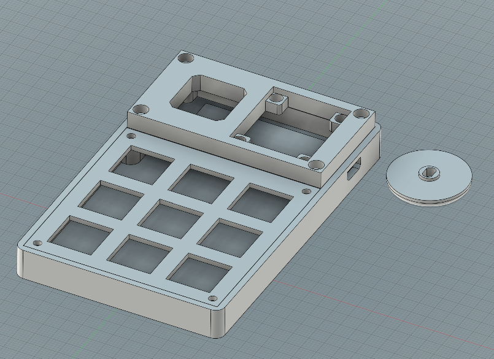
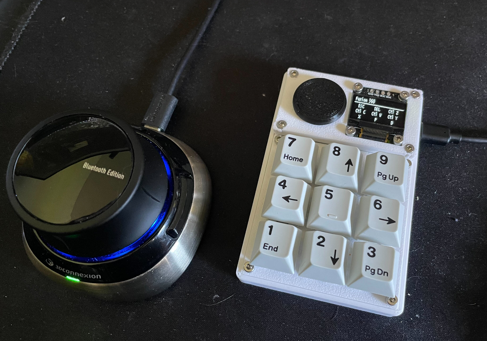

# Overview

A Raspberry Pi Pico based Macropad using components I had lying around. It supports arbitrary keymaps with multiple layers and a secondary mod layer. I made this to help with CAD/modelling applications, the goal was to cram as many possible keyboard shortcuts into a small space. The shell is 3D printed and the .step file is available in the CAD subdirectory.




# Building one

The whole project is pretty easy to put together assuming you have hands and a soldering iron. I don't expect anyone to actually build one, but there isn't a lot of sample code for something like this out there. It's either quote complex, targeted at fully custom keyboard builds, or one off MicroPython based. This to me is a happy medium using the Pico Pi SDK directly with enough complexity and configurability to be actually usable and maybe it'll be a good reference.

## Components

 - Raspberry Pi Pico (the first gen is ideal for this due to the very low performance requirement)
 - 9 cherry keys + keycaps
 - 12 M2.5x8 socket head bolts
 - 12 M2.5 heat set inserts
 - 4 M2x4 socket head bolts
 - 4 M2 heat set inserts
 - 6 1N4001 diodes
 - 1 SSD1306 display
 - 1 [Adafruit Thumbstick](https://www.adafruit.com/product/2765) + [breakout board](https://www.adafruit.com/product/3246)
 - Wires to tie it all together

The main component is a Raspberry Pi Pico or Pico 2, you can also use the W variant. The MCU will be mostly bored, so there is no need to waste a full Pico 2 on this. The other components were chosen based on "How many years have they been left unused in my drawer" and as such the project isn't necessarily based around parts availability.

## Assembly

The keys are held ins by friction only, a bit of CA glue may be desirable to retain them permanently so you can switch out the keycaps without ripping the keys out. The keys are soldered together as a key matrix with 3 rows and 3 columns with row 0 being top and column 0 being left. The display and thumbstick are both attached to the carrier piece on the top, although the thumbstick gets screwed in from the bottom and the display from the top. It's easier to desolder any pins from the display first and then soldering the wires straight to it so there is no interference with the Pico underneath.

Note that I'm stupid and didn't realize the keycaps would hang over the screws holding the key matrix in place. So screw it in first, then add the keycaps.

The pins can be configured via the config.h file, but the defaults are:

 - Key rows: GPIO 6, 7 and 8
 - Key columns: GPIO 5, 4 and 3
 - Display: SDA GPIO 16, SCL GPIO 17
 - Thumbstick: X axis GPIO 26, Y axis GPIO 27 (input and ground wired to the ADC pins)

# Configuration

The device is configured via a JSON file that can be accessed by navigating to the "System" keymap and hitting "Config". This will disable the HID keyboard and turn the device into a USB mass storage device with 64kb of storage with a "config.json" file in it. Once the configuration is on the device, ejecting the device will store it in the internal flash and reload the keymap configuration.

## Config syntax

The root object must be an array with each entry being one keymap. The keymaps are objects with the following keys:

 - `name`: The name of the keymap
 - `layers`: An array of layer objects

The layers array contains one or more key layer objects with the following keys:

 - `base`: The base layer that is displayed by default
 - `mod`: An optional mod array that is enabled when the mod key is pressed

Each actual layer is an array of objects, one per key to be mapped (top left to bottom right):

 - `t`: The type of key, either `mod` or `hid` (defaults to `hid` if unspecified)
 - `v`: The value of the key, for `hid` types this is the key to be pressed (single key only, must be uppercase, eg. `"X"`). Special values (case-sensitive):
    - `Tab`
    - `ESC`
    - `DEL`
    - `Enter`
    - `Space`
 - `m`: Modifiers to add to the key (`hid` only). Can be one of: `lctrl`, `rctrl`, `lshft`, `rshft`, `lalt` or `ralt`

## Example

Check out the examples folder for a full examples, but here is the high level overview

```json
[
  {
    "name": "Foo",
    "layers": [
      {
        "base": [
          {
            "t": "mod"
          },
          {
            "v": "X"
          }
        ],
        "mod": ...
      },
      ...
    ]
  },
  ...
]
```

